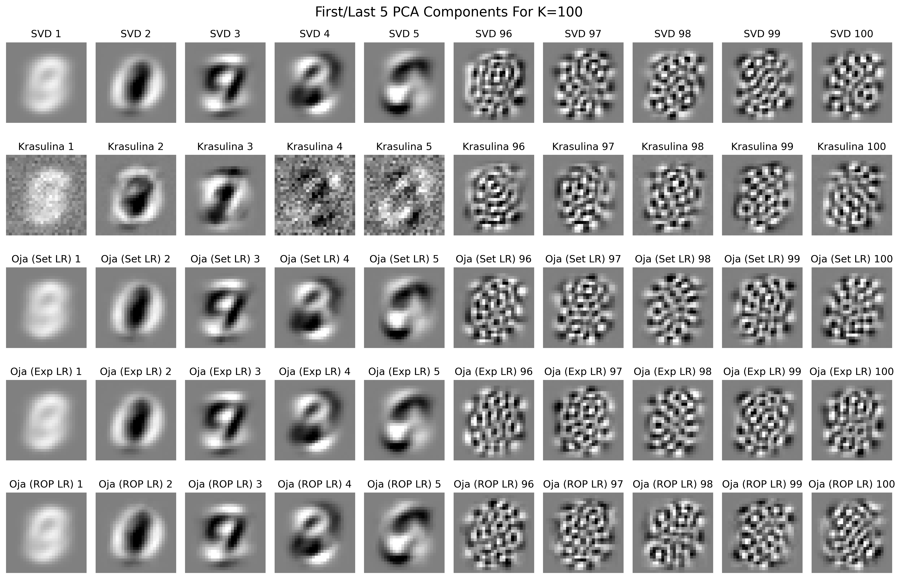

# ApproxPCATorch
Oja and implicit Krasulina approaches to batched approximate top-k PCA estimation. See mnist_test.py for usage. Batch size, dimension, and k all heavily influence which method might be the best fit for a given application.

